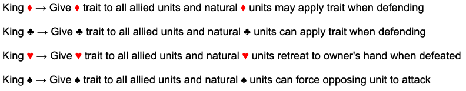
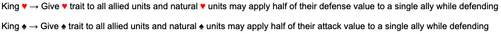
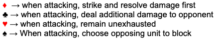
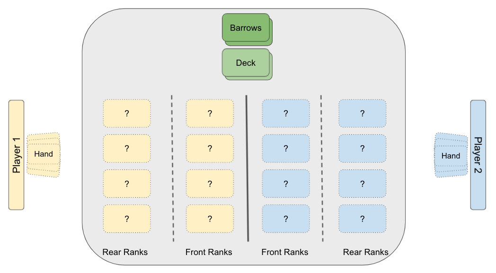
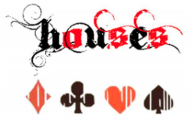
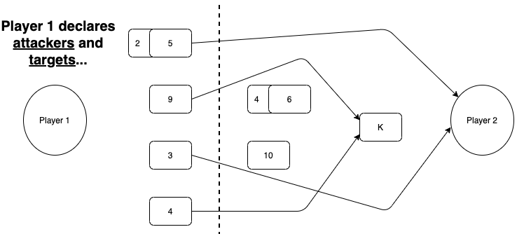
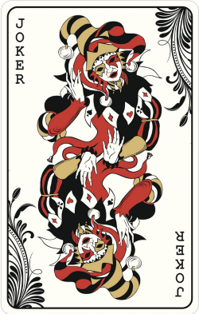
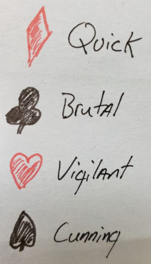

---
hide:
  - toc  # This hides the table of contents for this page
---
# HOUSES - Skirmish

=== "Blog"
    ### Spring '22 Updates
    
    We are still tweaking and finalizing some elements of the game. The ruleset summary above is what we are currently testing as the foundation of the next full release of Houses.

    #### Current considerations:

    1. How to structure the Kings
    2. The “feel” of the Spades
    3. The pace of the game
    4. Clear placement of game elements

    #### What to do with the Kings:

    The Kings have changed the most since the earliest version of the game. We had always thought of this card as representing a massive and direct threat to the opposing player. However, they way we approached this never felt quite right. The way each King functioned and their impact on the results of each match turned out to be the least liked components of the game. We far more enjoyed the subtle impact felt from playing the other face cards. We want the King to be more of an optional target rather than the only logical one.

    So we are now looking at modifying their function within the game to provide advantage through enhancing their soldier units, rather than directly impacting the opposing units or simply breaking the game. Perhaps the King’s presence on the battlefield will force opponents to consider the risks of using their current strategy or adopting another mid-game. So we are currently testing the following abilities of the Kings:

    

    With the above change, each King will allow units from another house to share their unique house trait. Units who naturally belong to the King’s house will have bonus abilities while defending as well.

    We are also considering the following alternative version for the King of Hearts and the King of Spades as well..

    

    This potential change would allow natural Spades and Hearts to aid an ally on defense, while their King is in play. The value added to an ally unit would be rounded down. <u>For example</u>: The 9 of Spades may aid an allied 7 of Diamonds when they are both defending by adding 4 (half of 9 rounded down) to the 7’s attack value.

    Though the above change fits thematically and strategically, it may be too complicated? 

    #### The Spades' House Traits

    From our play testing we have observed that the ability for the Spades to strike an adjacent opposing unit with their house trait, is rarely ever utilized. If we take a step back, this trait was a hold over from the earliest revision of the game where each card retained damage between rounds. At that time this house trait did fit thematically and strategically. However in today’s version of the game, where pinging an adjacent opposing card with an additional strike, is not very useful. For this reason we are also considering the following potential change to the Spade’s house trait.

    

    With the above changes, the Spades would be able to chose their blocker if the opponent chooses to block their attack. We are testing this for now…

    #### Late Game Slog

    As the game becomes more balanced, we are seeing the back and forth flow of control and advantage in the game. It feels good, for the first 5 rounds or so… If a match extends beyond this stage of the game, the players are playing one card at a time and the randomness of the outcomes becomes more of a factor. For example, once everyone has played all their cards they are just waiting to see what they (or the opponent receives) in their next draw. The pace of the game slows dramatically and this feels like a slog. So our proposed solution is to pick up the pace by allowing <u> each player will draw two cards after the match reaches a midpoint. </u>

    There are two ways we have considered for measuring this. The first would be to simply begin drawing two cards at the start of round six. The other option would be to monitor the height of the Deck and Barrows. Once they are equal (balanced) then the mid point of the match has been reached. We are not sure which option is best. We will continue to play test this further.

    #### Battlefield Layout

    We thought it might be useful to include a diagram the defines the battlefield layout for a match. This will be incorporated into the official rules at some point. Here is how a match should be laid out for both players.

    

    ## Summer '20 Updates

    This year we have had some time to dig deeper into refining Cards Of War! Our design team has now grown to include my brother and wife. They have brought a fresh perspective and introduced some exciting new changes to all aspects of the game.

    The currently accepted ruleset for our game is published here on this site , and is actually the 3rd revision of the rules. Each revision has been less and less of a significant change to the core mechanics. We like to think that this would indicate we are honing in on a solid game and design. Right now, we are focused on clarifying game and turn mechanics, refining the overpowered card abilities (*I am looking at you King of Clubs..*), more creative ways to use the Jokers as well as exploring the art, lore and story elements of the game. Much of our efforts have been framed by defining the proper thematic “feel” for each house and card’s abilities.

    The following changes to the game are currently under consideration for a future release by the design team:
    - New Game Title (“Cards of War!” would become “HOUSES”)
    - Adjusting Front Rank Limits (4 stacks of 2, instead of 3 stacks of 3)
    - Turn Phase Adjustments (a more structured process per turn)
    - Targeting Defined (a unit can only target the rear ranks card or opposing player)
    - Multiple Attackers (multiple units can attack a single valid target)
    - The Scouts (new abilities for the 2’s)
    - Jack of Clubs (changed to double damage dealt)
    - The Kings (much discussion here, details to come..)
    - Jokers (new Joker concepts and play mechanics)
    - New Condition (Soul Burned – a card can only be resurrected once)
    - New Player Lore (define player’s physical existence in the game)
    - Concept Art (some example concept art focused on house themes)
    - Terminology (clear definitions and usage of player, opponent, card, unit etc..)

    ---

    ## New Game Title

    The title “Cards of War!” was always meant to be a placeholder title for the game. We are now looking at officially retitling the game as “HOUSES”. The text font has been changed as well to provide a more stylized image and reference to the symbols for each “house”.

    

    There is already a commonly known card game titled “War” which we find too similar to “Cards of War!” By renaming our game to “Houses”, we may reduce confusion between the two card games. It is also important to remember that our goal is to have people learn how to play the game of “Houses”, grab a standard deck of cards and challenging friends to a game. Having a simple and memorable tile will compliment these plans.

    The introduction of a new game title will require minor updates to the Intro text of the game documentation, and potentially some of the art and lore components for the game. We have also secured housesthegame.com and housesthecardgame.com for future publication needs.

    ## Game Mechanics (additions, tweaks and clarification)

    ### Front Rank Limits
    
    The current ability to stack up to 3 cards (using the Blood Bond mechanic) seems to be unbalanced considering a player could potentially have a 27/27 unit in play. A 10, 9 and 8 Blood Bonded together could remove nearly ¾ of the opposing player’s maximum life in one attack.

    The rule changes under consideration will allow a Blood Bonded unit to consist of only 2 cards. An additional unit space has also been introduced to the Battlefield, increasing the number of attackers and defenders that can be in play. Currently rules allow players to have 3 units of 3 stacked cards in the Front Ranks and with this proposed change, they could only have 4 units of 2 stacked cards instead. While play testing this rule, we found the reduction of any single unit being massively overpowered has provided better balance in gameplay. Additionally, the number ‘4’ works better thematically to reflect the number of “Houses”. 

    ### Soul Burned

    Though it is a little “broken”, we believe it is fun to resurrect a defeated card, and bring it back onto the Battlefield from the Barrows. While looking for more ways to offer this mechanic, we also needed to find a way to better balance it.

    Currently the Queen of Hearts (*or the Doppelganger posing as the Queen of Hearts*) only have the ability to bring cards back from the Barrows. This allows the potential for any card to be brought into play up to 3 times. For example the Ace of Spades could be deployed by itself normally, resurrected by the Queen and then again by the Doppelganger. This could be potentially over powered to have access to an assassin (*or any card*) card three times. There is also a potentially complicated and difficult to define situation of the Queen or the Doppelganger resurrecting each other.

    Now, one of the new proposed Joker variants (*the Necromancer*) will add more options to bring cards back into play, along with the ones listed above with the Queen of Hearts and the Doppelganger.

    To bake in the new Joker variant and different method for bringing cards back into play, we developed a new concept called “Soul Burned”.

    !!! tip ""

        **Soul Burned** – A resurrected card that is defeated or decayed, is removed from play permanently for the remainder of the game and can no longer be resurrected.

    ### New Barrows Mechanic

    With the introduction of the new Soul Burned mechanic there was clearly a need to indicate an affected card while avoiding clutter on the table top. We did not want to create a new discard pile or place the cards back in the box, so we are proposing a new method for managing the Barrows discard pile. When a card is to be completely removed from the game they will be placed in the Barrows face up. Players may look through the Barrows at any time to identify which cards have been removed permanently or might be available for bringing back into play.

    ### Determining Starting Player

    The current rules suggest that players roll a die or flip a coin to determine who gains first advantage at the start of a game. The new recommended method will be for each player to draw a single card from the top of the deck, <u>**after**</u> each player has looked at their starting hand. The player who draws the highest card (*aces having the lowest value*) gains advantage and declares their intent to start first or defer to another player. It seemed strategically valuable to allow the player who wins advantage to choose after looking at their starting hand. We often find that a player’s starting hand will dictates the optimal play style for that game. It might be wiser to take the initiative and go first, or allow your opponent to lead.

    Additionally, the cards that are drawn to establish player advantage are immediately placed in the Barrows. This change to the opening of a game provides a couple of interesting elements.

    1. The discarded cards provide something to be resurrected in the first round if a player has the option to do so.
    2. We have never spoken about why the cards go to battle each time the game is played. Observing the discarded cards opens an     interesting story element to each game and the overall lore. We have quickly adopted this method as our favorite, as it is fun to take a moment at the start of each game to theorize how the discarded cards are involved with the initial event that sparks the battle at hand between the houses. 

    Maybe the Jack of Diamonds was having a secret love affair with the 6 of Hearts. They were discovered and perhaps a King had one killed to cover it up?… or… the Ace of Spades may have assaulted in a bar by an intoxicated 8 of Clubs and later that night the Ace exacted his revenge in an alley?

    ### Redeploy Cards and Separating Units

    For future releases we will need to provide clarification for the act of redeploying cards. Redeploying a card is a means of separating Blood Bonded units or removing cards from the Battlefield. This definition is not a change to the current game, only a better explanation of the current rules and mechanics.

    !!! tip ""

        **Redeploy** – A player may redeploy their cards to any valid position on the Battlefield or directly into their hand. Players can only redeploy cards on their turn and as a single action. Cards redeployed to the Player’s hand may not return to the Battlefield until the player’s next turn.

    Redeploying a card is the method for creating or separating Blood Bonded units. Players may only choose to make a redeployment action, once on their turn. Separation of cards can only be accomplished if there is room in the Front Ranks to do so. For example if there is no room to split a Blood Bonded into two spaces in the Front Ranks, then you must wait until there is space to separate the unit or send one card to the Barrows.

    ### Targets and Targeting

    We see that some clarification and tweaks for targets, targeting, attacking and blocking were required. We will provide more clarification on this in our next rule set release.

    !!! tip ""

        **Valid Target** – Units that enter the Battlefield from the Rear Ranks may declare a target in any other rank, however Units that enter the Battlefield from the Front Ranks may only target an opposing Player or Units in the opposing Front Ranks. 

    Previously it was stated that a target can only be attacked by a “single unit”. We have found that it may be best to allow multiple units to attack a single target. This provides smaller units the ability to threaten the rear ranks if they are allowed to strike. This change is only intended to provide better clarification and more strategic combat.

    ### Attacking and Blocking

    The following diagram displays the results from Player 1 choosing targets and Player 2 choosing their blockers.

    

    The 2 and 5 are Blood Bonded with the 5 leading. They are targeting the opposing Player along with the 3. The 9 and 4 are both targeting the King located in the opposing Rear Ranks.

    

    The 10 is designated to block the Blood Bonded 2 and 5. The Blood Bonded 6 and 4 (with 6 leading) blocks the 9.

    - Player 1 – Looses the 5/2 Blood Bonded unit as well as the 9
    - Player 2 – Takes 3 damage and looses the 6

    ### Player Turn Phase

    We found some confusion in the order of events each turn, so we decided to tweak to the Player Turn Phase. Here is a simple overview of the new changes:

    1. READY your units
    2. DRAW a card
    3. DEPLOY or RE-DEPLOY (all cards and apply abilities)
    4. RESPONSE from opponent
    5. COMBAT (declare attackers and targets, and opponent declares defenders)
    6. RESOLVE damage
    7. END turn

    Over all we found little reason as to why special abilities could not be applied during the DEPLOY phase. This places more significance on the fact that all of the Royal and specialty cards actually enter the battlefield (via the Rear Ranks) and must take their actions alongside the deployment of Front Rank cards. As all cards must enter the Battlefield in some fashion during the deployment phase, they therefore become vulnerable to responding actions from the opponent, such as assassination.

    The DEPLOY phase starts with the current player deploying all cards/units and then allowing a pause for the opponent’s RESPONSE before the start of the COMBAT phase. The lingering doubt we have at this time is that this removes the option for a player to force the opponent to commit blockers and then surprise them with double damage, etc.. Overall this change frames the game in more of a strategic (action/reaction) light rather than an “Ah Hah! Gotcha!” type of game.

    ### Player Hand Phase

    The other significant change to the Player Turn Phase as well as the core rules, will be the removal of a player hand limit. There does not appear to be a good reason to force players to discard down to 5 cards at the end of each turn, and there is certainly strategic reasons to allow players to play at their own pace. We will be likely removing the hand size limit and the CLEANUP phase each turn.

    ### Response Phase and Instant Plays

    In many cases it was complicated to resolve how cards could be instantly played. The timing for playing these would lead to confusion and more advantage than they were intended. We are considering adjusting the use of cards that could normally be played instantly at any time, to now play be playable only during the RESPONSE phase.

    The following cards would be affected by this change:

    - Jack of Diamonds (end opponents turn)
    - Jack of Clubs (double the damage of any designated unit)
    - Jack of Hearts (absorb all damage dealt to allies this turn)
    - Jack of Spades (gain control of target card)
    - Jack of Diamonds (defeat target card)

    ### The Scouts

    Sometimes it is important to present a strong defense, aggressive offense or eliminate the larger threats. Other times it may be important to know what you opponent is preparing to do. In response to this, we have introduced scouts into the game.

    With this new version of the game, we will be introducing a new special ability for the 2 card in each suit. The core concept is that a player may choose to deploy their 2 card (of any suit) as a “scout” to seek information about the opponent’s hand. If this gains no strategic advantage at the time, they may simply deploy the 2 as a simple soldier unit to the Front Ranks instead. If the 2 is used as a scout they are typically discarded to the Barrows following the conclusion of their scouting mission. Each suit’s 2 accomplishes this in a different fashion to be explained in the flavor text in relation to their House’s theme. This change is being designed in a fashion similar to the extra abilities granted to the Aces when the concept of Assassins was previously introduced into the game.

    - 2 of Diamonds (reveal 2 random cards from an opponent’s hand)
    - 2 of Clubs (reveal and defeat a random card from an opponent’s hand)
    - 2 of Hearts (reveal a random card from an opponent’s hand and deploy to the Front Ranks)
    - 2 of Spades (reveal and gain control of a random card from an opponent’s hand)

    The core purpose behind this change was to introduce a realistic component of warfare while allowing for more strategic angles. Scouting the opponent’s position and abilities is just as strategically important as assassinating or eliminating key targets. The 2 card seemed to have very little strategic value in the front ranks as it only serves as a potential blocker. For example it could not be Blood Bonded with a 10 (for 12 Attack) and threaten the King with 13 Defense. The 3 of each suit can however, and so it has much more offensive value than the 2. 

    ### Jack of Clubs

    The Jack of Clubs currently removes a random card from an opponent’s hand and has it discarded. This was described as rallying the troops with a charge that causes a single opponent to flee in fear. Presumably this fleeing card would find its way to the Barrows, possibly with an arrow in their back? 

    A future version of the game would likely modify the Jack of Clubs in a way that stays more true to the house’s aggressive style, by adjusting damage being dealt rather than removing a random threat. 

    !!! tip ""

        The <u>Jack of Clubs</u> attempts a rousing pre-battle speech only to be struck down by an errant arrow mid-sentence. This stirs an allied unit into a frenzied charge, fighting with greater skill and aggression.
        
        **A single unit deals double damage for the current turn only.**

    With the introduction of the scouts (Clubs and Spades), removing cards from the opponent’s hand is now similarly accomplished in a different way. Randomly removing a card from a player’s hand feels more like a Spades move. In the spirit of the Clubs delivering devastating damage, that may even spill over onto the opponent with their House Trait, it feels fitting that they gain a single turn surge of damage. This would only apply to a single unit’s attack value as enhancing the entire Front Ranks might be overpowered. Also…it is still funny to see the Jack meet an awkward or comical fate that ultimately benefits their army for a single turn.

    The threat of boosting the attack damage of a single unit that may be **blocking** or **attacking** could add many more layers of strategy to the game. 

    ### New Joker Variants

    The Black Joker is currently identified as the Doppelganger, which is creature that can mimic any other card the Player wishes. A new optional variant of the Black Joker will be a Necromancer who can resurrect a single defeated card from the Barrows each round.

    !!! tip ""

        The <u>**Black** Joker</u> is an ancient necromancer (+0/+14) who brings promises of an endless army. Upon entering the battlefield, the necromancer may summon a Front Ranks unit (2-10) from the barrows that can act immediately. At the beginning of the next turn, the unit disappears and is placed face down next to the barrows, where it is no longer accessible for summoning. The Necromancer can use this ability only once per turn.      

    ..**or**..

    !!! tip ""

        The <u>**Black** Joker</u> is a mythical creature known as the Doppelganger. When the Doppelganger is summoned to the battlefield, it may mimic the form of any other card of the player’s choice. While this creature remains in play, it gains all abilities and stats of the chosen card, and is deployed to the appropriate rank for the card it is imitating.
    
    Both cards allow a player a type of “wild card” access to any card that they may not have been able to draw. However the primary distinction between the two is the Doppelganger may provide this advantage permanently one time, and the Necromancer may provide this advantage temporarily each turn. 

    The Necromancer is also limited to providing access to cards that can only be deployed to the Front Ranks and they can act immediately as a zombie of sorts. In contrast the Doppelganger allows access to the royal family cards and assassins with their normal deployment rules remaining the same.

    We have considered a new variant of the Red Joker as well.

    !!! tip ""

        The <u>**Red** Joker</u> is an insane wizard (+0/+14) who reluctantly agrees to support the player’s army. Upon entering the battlefield, the wizard casts a powerful enchantment that causes a deep red fog to spread across the battlefield, swirling around opposing soldier units. Affected units forget who they are and immediately loose access to house traits or a Blood Bond with any other card. All battlefield unit limits apply and cards that cannot fit on the Battlefield after loosing a bond are defeated and must journey to the Barrows. The opposing players chooses which cards remain on the Battlefield.  

    ..**or**..

    !!! tip ""
        
        The <u>**Red** Joker</u> is an ethereal entity (+0/+14) known as the Binding Spirit. The Binding spirit’s presence is warm and reassuring for allied units, providing a sense of camaraderie where there had not been one before. All allied soldiers may form a Blood Bond with any other allied soldier. The leader of the bonded unit defines the House Trait rules to be applied.

    Both Red Joker variants provide similar manipulation of House Traits and Blood Bonded units. One provides an expanded advantage to the player while the other simply removes it from the opponent.

    All of these characters offer unique strategic advantages as well as interesting story angles. We believe it would be wise to allow the players to deploy the variant of their choice when they play a Joker. Perhaps one variant offers more strategic synergy with a players style than another?

    Artistically we would like to have each variant represented by a slightly different mirror image on the same card. The persona of choice could be represented by flipping the card one way or the other upon deployment. If using a standard deck, then the player should simply declare which variant they are deploying.

    

    ### Redesign of the Kings

    We have had much discussion on the best direction for the Kings. We all agree that the Kings must represent a significant advantage for the player and are intended to pull the focus of the opponent’s attackers. It is a significant choice for any army to risk their King by bringing them onto the Battlefield. With great risk, should should come great reward. However, the Kings must not be game breaking either.

    Here is our assessment of the current abilities for each King:

    - King of Diamonds (units can attack on the same turn they are deployed)
        - **We like this and it feels thematically correct and balanced enough.** 
    - King of Clubs (deals 13 points of damage to enemy soldier units)
        - **This is too much power, and the player too easily dominates the Battlefield.**
    - King of Hearts (absorb 13 points of damage that would be dealt to allied soldier unit)
        - **This is annoying, allowing a player to “turtle up” and stall the game.**
    - King of Spades (soldier units cannot be blocked or attacked)
        - **This is very over powered. In play testing, this player typically wins.**

    We need to tweak these and so we are faced with two possible approaches to redesign and balance the Kings.

    <u>Option 1</u>: Continue with each King bringing a unique power that fits thematically while not breaking the game play.

    <u>Option 2</u>: Each King’s presence on the Battlefield enhances the House Traits available to the player’s units.

    ### Kings that Bring Unique Abilities (Option 1)

    <u>The King of Diamonds</u> – As mentioned above we have no issue with the current design of the King of Diamonds. This ability plays well in our test games as well. If a player decides to deploy this King, they tend to lean into a more aggressive play style to fully utilize this ability. However if they are not careful they might over extend and open themselves for devastating counter attacks. This King’s abilities are not too strong and they fit thematically.

    <u>The Kings of Clubs</u> – The current rules allow this King to force any opposing soldier to step out and fight them. This challenge cannot be blocked or ignored. The end result is that the King just picks fights that they can win and simply eliminates a soldier unit each turn. This has the effect of an assassination each turn and gives the Player who deploys the King of Clubs too much control over the Battlefield. The funny thing here is that we have been trying to scale the King of Clubs since the inception of this game. It is tricky to provide a dominating force that fits thematically and doesn’t break the game.

    Currently we are considering having the King of Clubs’ presence on the Battlefield allowing the Player’s Front Rank units the option to target the opposing Front Ranks units. This would be a significant advantage as the opposing player would lose the ability to choose who blocks each turn. Thematically the King might be inducing a sense of panic and fear for the opposing soldier units. Perhaps an army in disarray is less disciplined and attacking units may take advantage by catching them out of formation?

    <u>The King of Hearts</u> – Similar to the King of Clubs, the King of Hearts has been trouble for us from the beginning. Back in the earliest revision of the game, we were tracking health on each unit and the Hearts were supposed to provide healing support. Additionally the King of Hearts was originally designed to provide some direct balance to the King of Clubs. The current ruleset allows the King of Hearts to absorb up to 13 point of damage that would be dealt to an allied soldier unit of choice. If 13 (*or more*) points of damage is absorbed in this way, then the King will be defeated.

    This design is not necessarily “broken” as the King risks themselves to protect allied units. However it can still be annoying for opponents to deal with, until they can deliver 13 (*or more*) points. The strategic value of this King depends on how early the Player is able to deploy them. From a thematic perspective this design is not really a problem either (*as this still balances the King of Clubs*) however it still feels… <u>not quite right</u>. We are continuing to look at this and perhaps this only needs a slight tweaking?

    We have discussed a few potential changes for the King of Hearts. <u>The first option</u> is having the King presence on the field provide a magical sense of “awareness”, thus providing the Hearts trait to all other soldiers under the player’s control. This means everyone (*all soldiers from any house*) in the player’s army would remain available to block after attacking. This might be too overpowered? However it fits better thematically as the Hearts are supposed to be more “Vigilant” and “Mystical” in design. <u>An alternative option</u> would be letting the King allow the Front Rank units to pick (*or reassign*) their blockers. This last option is similar to the proposed option for the King of Clubs above, however instead of targeting the opposing Front Ranks units, allies of the King of Hearts may (*magically?*) shift their formation after blockers have been assigned. This would allow them to counter or deny the opponent’s choice for blocking. This may be the option that works better? However we likely need further play testing with these options before we lock in on the King of Hearts for the next version.

    <u>The King of Spades</u> – Oh… the King of Spades… You are truly the broken card. The King of Clubs only thinks they are the serious threat, however we have come to learn the truth. To understand the problem we have with this card, we have to look back at earliest design of this game. 

    Here was our starting point back in 2017, scribed onto a sticky note..

    

    The Spades are supposed to be cunning in design, and by that we mean “tricky”. Their advantage comes from being able to fool and misdirect their opponent. We landed on the ability to prevent units from being blocked or attacked early on. It felt sneaky and cunning enough and it has not changed since inception. I think in playing the earlier versions of the game, this advantage did not stand out as a big deal. The combat and targeting rules have changed a little over time however and now this appears to be <u>very overpowered</u>. In the current version of the game, the opponent (*when being attacked*) only has a few options to control the outcomes. They have very few cards to play in response (*Jacks, etc..*) as well as having the ability to choose who blocks the attackers. We see now that, by removing the ability to assign blockers, the opponent is essentially helpless.

    This last summer we were able to put this game through lots of testing. We were recording the win conditions and cards in play from each game. In nearly every game where the King of Spades was brought into play, the controller of that card would win the game. In fact one of our play testing scenarios involves splitting the deck into the four suites, removing the Jokers and pitting random suites against each other. Essentially each player pulls from a draw pile containing only cards of their house. Long story short, the Spades won every time. Most of the time this was directly attributed to the King being in play and preventing the opponent from doing anything. So…yeah we know we have a problem here. So what to do? We need to adjust this while staying thematically accurate, and the King still needs to bring the sneak without the total dominance.

    One option that we are considering is having the King of Spades provide the house trait of striking twice to all allied soldier units. Of course the second strike is only an option if they defeat their blocker. This was similar to the solution that was proposed to the King of Hearts above. The formula is to just impart the house trait onto the other, non-spades units. Unfortunately in play testing this proved to be a little bit over powered and provided the Player with too much Battlefield dominance. So we scaled it back by designing the second strike to only “stun” the opposing units. Rather than killing them, this would just lock them down for a whole turn. This was less devastating, but still pretty powerful.

    We do like the mechanic of stunning opposing Front Rank units, and essentially preventing them from attacking the next round. Early on in the game’s development we identified the Diamond and Clubs houses as having more offensive strategies and the Hearts and Spades being more defensive in nature. Stun locking your opponent or blocking their potential damage are both pretty solid “defensive” strategies. I think we will be making an adjustment to the King of Spades in next version of the game. There may be other alternatives that we can explore here as well. As always, more play testing is needed.

    ### Kings that enhance House Traits (Option 2)

    As we were exploring options to “fix” the Kings, we found ourselves discussing the ability for a King to impart their house’s traits to allies from other houses. In a sense they are accepting this individual from another house to join them in battle. You might say they are adopting them into their house for the war and it would not be a stretch to say they would share their family’s strategic secrets or magical enhancements. So.. we borrowed from some of the “options” above and laid out how this might work.

    <u>King of Diamonds</u> – The King shares a secret tactic with all allied soldier units, so that when **attacking** they may strike and deal damage before the opponent can. <u>Additionally</u>, all allied soldiers that are originally from the House of Diamonds, may also perform this action when **blocking**. If two opposing units are attempting to employ this technique at the same time against each other, then this is canceled out.

    <u>King of Clubs</u> – The King’s brutal nature encourages all allied soldier to throw themselves fully into every **attack**, and therefore deal all remaining damage (after combat) to the opposing player. <u>Additionally</u> all allied soldier that are originally from the House of Clubs, may also choose to do this after **blocking** an attacker.

    <u>King of Hearts</u> – The King casts a powerful spell that grant all allied soldiers the strength to remain available to defend as a blocker after **attacking**. <u>Additionally</u> all allied soldier units that are originally from the House of Hearts have the alertness to anticipate the opposing unit’s strategy and shift to the **blocker** of their choice before combat ends. Units who perform this maneuver must trade blockers with another allied unit.

    <u>King of Spades</u> – The King provides all allied units with enchanted weaponry that vibrates with power, allowing them to stun a single adjacent opponent when **attacking**. <u>Additionally</u>, all allied soldier units that are originally from the House of Spades may also use these weapons to stun an adjacent unit when **blocking**. The stun affect is applied, even if the allied unit is defeated during combat and can take place in any order the player chooses when resolving combat. If two opposing units wielding these enchanted weapons clash, the affect is canceled out.

    Option 2 for the Kings focuses more on strategy at the Front Ranks level, rather than the King directly interacting with the opponent’s army. The King would still remain a threat worth removing if the opponent is tired of dealing with the added impact of house traits. However, depending on the strategy and play style of each player, the opposing King may not always be a threat worth focusing on. Also, with the King’s abilities only sharing the house traits with non-members of their house, we needed to find a bonus to members of the King’s house that would already have these abilities. In most cases allowing these to apply on the defense gave us more strategic options for the defending opponent and looks to be strategically fun.

    We believe the impact the Kings will bring to the Battlefield with this option, will remain significant as well as balanced. We imagine many interesting attacker and blocker combinations that might play out, adding many more layers of strategy to the game. These gifted abilities and actions would all need to be resolved by both armies during each COMBAT phase as well. It could get messy, but we found this fun to experiment with. We expect to continue exploring this option for redesigning the Kings. <u>**NOTE**</u>: *We may need to modify the Spades current trait to stun rather than deal damage on the second attack, if we go down this path.*

    ### Beyond the Next Version

    - We are working on custom art for each of the cards, that will tie back to each house’s theme.
    - We will be expanding the lore and stories from the world of the game as well as exploring the Player’s role in the game.
    - We have plans to define rules for handling more than two players, both in team and “free for all” formats.
    - We will be building a nice dictionary of game terminologies on our website as a supplemental reference.
    - We are looking at defining different rulesets, with optional rules for simplified or more advanced play.
    - We are looking ahead at how the game could be designed work with different themes. HOUSES *IN .. SPACE!!!!* 

=== "Rules"
    Here are the current rules for this game.

=== "Summary"
    Here is the simple breakdown of the rules.

=== "Layout"
    Here is an example layout of the game board.

=== "Art Concepts"
    Here are some art concepts for this game.

=== "Lore"
    ### The House of Hearts
    
    The family of “hearts” is only a nickname. The Miezhala family dates their lineage back to the earliest times of the land, when all was under the leadership of a single individual. That ancient ruler conquered and tamed the broken land, ushering in a time of peace. The world would not stay peaceful for long however, and would all to soon be sundered apart by war once again leaving the world broken into the four kingdoms of today. But for that brief moment in time there was peace and harmony. The Miezhala family were the steady and resilient core of that ancient kingdom’s rule. They were peacekeepers and healers. It was (and still is) a common tradition for all young members of the Miezhala family to choose to serve in the royal guard or join the order of healers and priests upon reaching the age of thirteen.

    One commonly known tale of the family of “hearts” speaks of two Miezhalan brothers, who served as the first official sentinels of the kingdom and it’s ruler. They were hand picked by the ruler as children to serve as his bodyguards, and were the pride of the family. It is rumored that for those years of brief peace, there was always one of the brothers by the ruler’s side. The brothers were of slightly different ages, however their distinguishing features were very similar, as that of twins. It would often appear to outsiders that the very same person was tireless in his effort to protect the ruler. Sadly it was this trust and close proximity to the ruler that ultimately ushered in the war that would end all peace. One evening a brother discovered the other’s heinous betrayal of their lord and kingdom. That exact act of betrayal differs from version to version of the story. However, all versions of this story agree that the tragic result was an epic conflict between the brothers that raged through the castle and lasted well into the next day. When the dust settled only one brother remained alive. To this day, it is not known which brother prevailed over the other. It is rumored that their mother’s heart was broken upon learning the news. The loss of one son was unbearable and she could no longer look the other in the eye. The story claims that one morning she simply disappeared and was nowhere to be found. It is believed that she left for lands beyond, in search of ancient magic that would bring her lost son back to her. She would never return home.  Some suggest that the family crest symbolizes the two brothers standing proudly back to back keeping a vigilant eye over the kingdom. Others have suggested that the crest may also resemble the two brothers locked face to face, in a hunched struggle as they fought that fateful night. Their sacrifice and time of vigilance has inspired many songs.

    Today the country ruled by the Miezhala family might still be considered the heart and core of the land. This innermost kingdom is their inheritance from what was once ruled by the ancient lord. This country sits geographically in the middle of the other countries. For this reason, much of the trade between the other kingdoms must pass through. This land is characterized by a tall mountain range, that effectively splits the world in half. Among the tall mountain peaks are small hidden valleys where the people live. There are many such valleys that have not seen visitors from the other lands in a very long time. The great Miezhala city of Sadr famously offers sanctuary and protection to all those who seek it. All manner of people from each of the other kingdoms will commonly seek refuge in Sadr. It is located on one of the largest trading routes through the mountains.

    ---
    *In the general background and story above I tried to explain the Hearts suit a little better. For example, how and why the symbol is shaped as it is. I also gave background and meaning to the magical ability of the Queen of Hearts in the actual game. Other attributes of the Hearts family and the cards abilities were explained and reflected in the story.  It will take a long time, but it would be fun to build stories like this out for each card or family in general and release them on our website.  –RJ*

    ---

    ### The Traveler
    
    For years I have traveled far and wide in a desperate search to find my way home. This is a fascinating and dangerous place in which I find myself trapped, and I fear I will never escape. I hope that these notes might someday be of aid, if you too find yourself trying to navigate this world.

    To the best of my knowledge, there are four geographic regions across the land with each one being vastly different from another. Each landscape presents different challenges and so has forged the native people into very unique cultures. Within each of these regions you will find a kingdom presided over by a royal house. I have come to know them as the quick Diamonds, brutal Clubs, vigilant Hearts and cunning Spades. 

    To the far north you will find the desolate and dry lands of the House of Diamonds. In the west, among the dark forests you will find the House of Spades. To the east, where the land is wild and broken by an extensive system of rivers you will find the House of Clubs. Centrally located between these regions are the tall, cold peaks of a massive mountain range and the House of Hearts. All across the land there exists a tentative peace between these ruling houses and so trade and travel between them is not uncommon. I have been able to visit and document some of the traits of these very different lands and peoples. 

    There is however, one strange commonality that I have observed across these very different cultures. As long as anyone can remember, each ruling house has always recognized the same thirteen positions of honor. Each house believes that maintaining this structure is an ancient and unquestionable duty. The method for appointing individuals to these positions is different between the kingdoms, however the fact remains that the following people exist and can be identified for each of the ruling houses. 

    The **King** and **Queen** share the responsibility of governing their people along with their heir, known as the Jack. The art of espionage and intelligence is performed by the **Ace** and **Two** of each house. The **Ten** leads each army with the **Three**, **Four**, **Five**, **Six**, **Seven**, **Eight** and **Nine** serving as commanding officers.

    I have heard rumors of another such as me, who may also be trapped here. Unfortunately their identity and location has eluded me so far. Perhaps some day we may meet? *–The Traveler*
