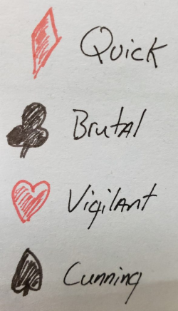

## Developing Lore for Cards of War
Early on (*working with just Cards of War*) we knew that each card suit would have a unique personality and attributes that would contribute to its game play. It was useful to imagine special abilities, values and even stories that would become core to defining each house. Before we could expand on those things however, we had to start somewhere. So wanted a simple word to describe the essence of each house. So we began with the **quick Diamonds, brutal Clubs, vigilant Hearts and cunning Spades**…

These simple words were our starting points for exploring each unique card suit.

## Why Build Lore?
This primary reason for exploring lore for a simple card game is to help develop each house’s unique attributes and game play. Secondly, we though this effort will additionally assist an artist in visualizing custom images for each card. More information the art for the game can be found here.

As we worked on this process together, we considered that the people, land, politics, economy and warfare of each community surrounding a house are influenced by the values of their royal family and their uniqueness from each other. It was our hope to also identify traits that provided distinctness in appearance and general disposition. We wanted there to be obvious balance and contrast between each house as well. The identified potential benefits of this effort are summarized below.

- Help define a unique play style for each suit
- Help an artist visualize custom art for each card
- Give players something to imagine during play and hopefully make it more fun?
- Provide a creative outlet and make this game more ours.

## Planning
Though we have completed an initial release of the game. We have only rough ideas of the uniqueness between each card suit or house in the game. There is no reason why the game cannot have different revisions or flavors over time. The core attributes of the Spades suit for example may be re-imagined as something else. It is possible that totally different suits (card symbols) might be introduced into the game. Aside from new game play angles, this would potentially bring new unique cultures and ideas to the lore of the game as well. The options are limitless. However, for the current version of the game, we have considered the following core attributes for each house. These attributes were used to develop game play and abilities.

### --Diamonds--
- Fast/Quick or Impulsive
- Charismatic
- Athletic
- Sharp witted, jokers
- Dominance of auburn hair

### --Clubs--
- Powerful
- Brutal / Bullies
- Sloppy and disheveled
- Forceful politicians and leaders
- Skillful warriors (berserkers)
- Careless for the life of others

### --Hearts--
- Duty and honor bound
- Solemn
- Protective
- Selfless or self sacrificial by nature
- Conscious of the lives of others
- Prideful
### --Spades--
- Very serious and stern
- Sharp dressed, clean
- Professionals
- Persuasive
- Clever / Stealthy
- Tacticians (Strategical)

## Translating to Game Play
From the collection of unique attributes for each house we developed the individual abilities of each card. It was a bit of a joke at first, but we new that the action of each house’s Jack card would result in their immediate demise. We wanted this to be a sudden play in the game that might catch an opponent off guard. We also felt that the Queen cards would only remain in battle for a single round and the King would remain in play until it could be defeated. We were also looking for a combination of leadership and magical skills between the houses. Here is a summary of what we came up with for each house.

:diamonds: :material-arrow-right: The "Quick" Diamonds
| Card | Initial Plan | Actual Ability|
| ----------- | ----------- | ----------- |
| Soldier | strike quickly | recieve no damage as attacker |
| Ace | surprise assassination | take action on any turn | 
| Jack | die, reckless | interrupt opponent’s turn |
| Queen | magic, slow time | take an additional turn |
| King | magic, speed advantage  | deploy without exhaustion |